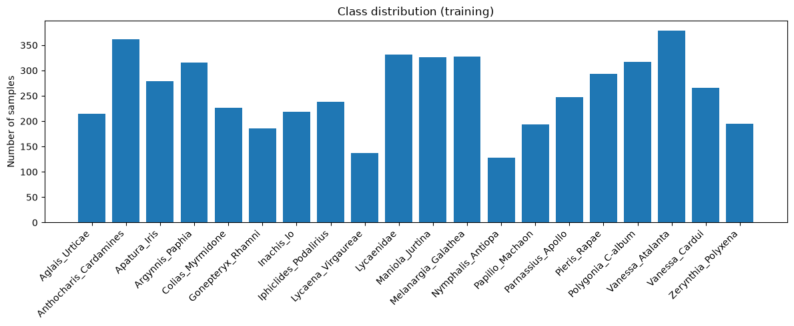
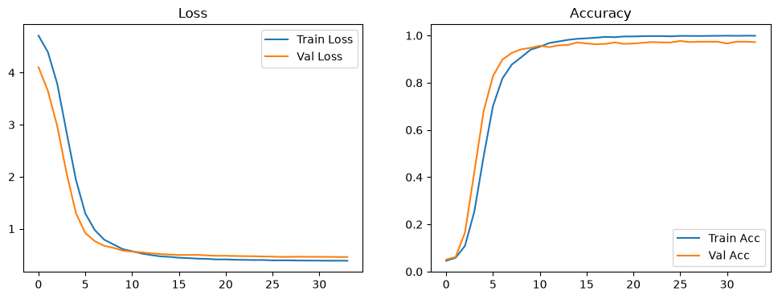
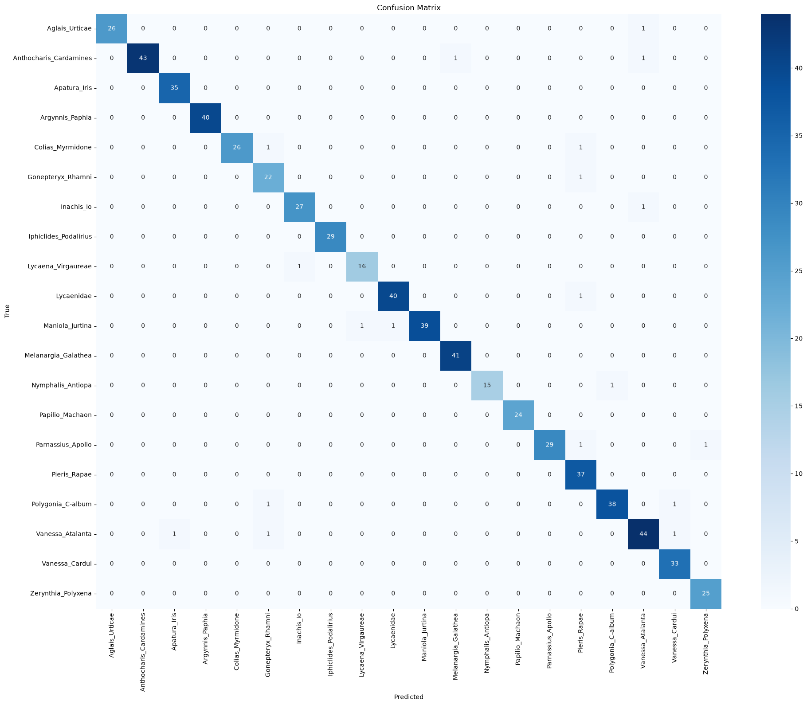
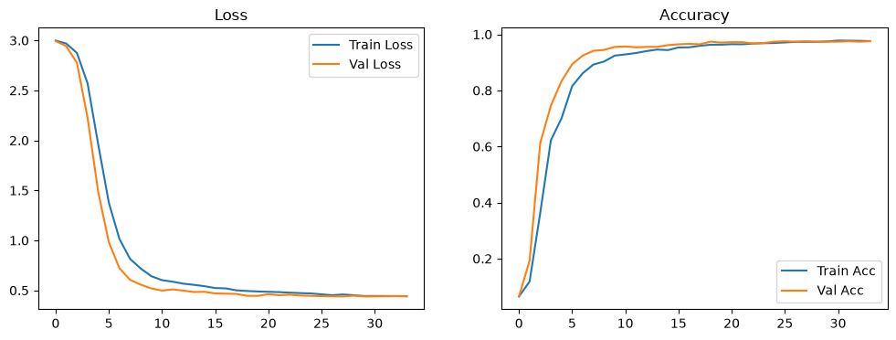
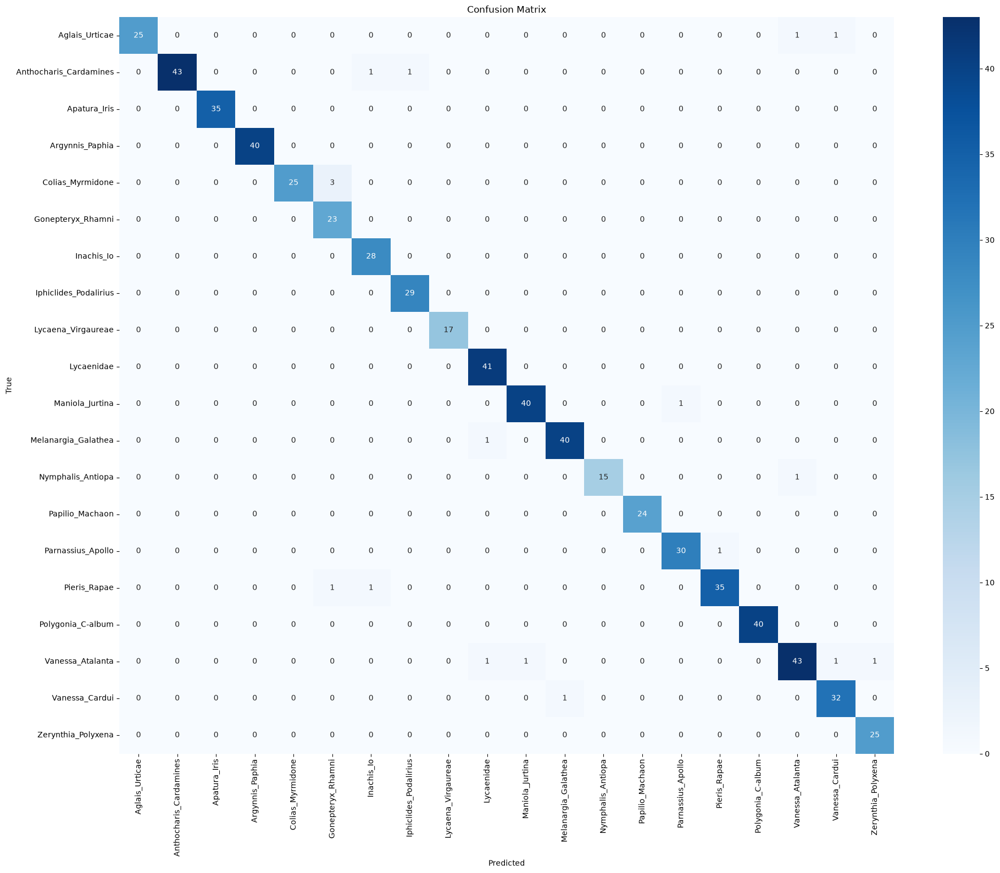
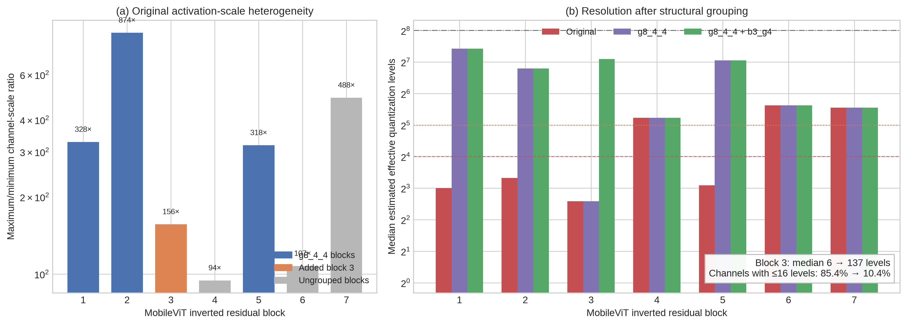
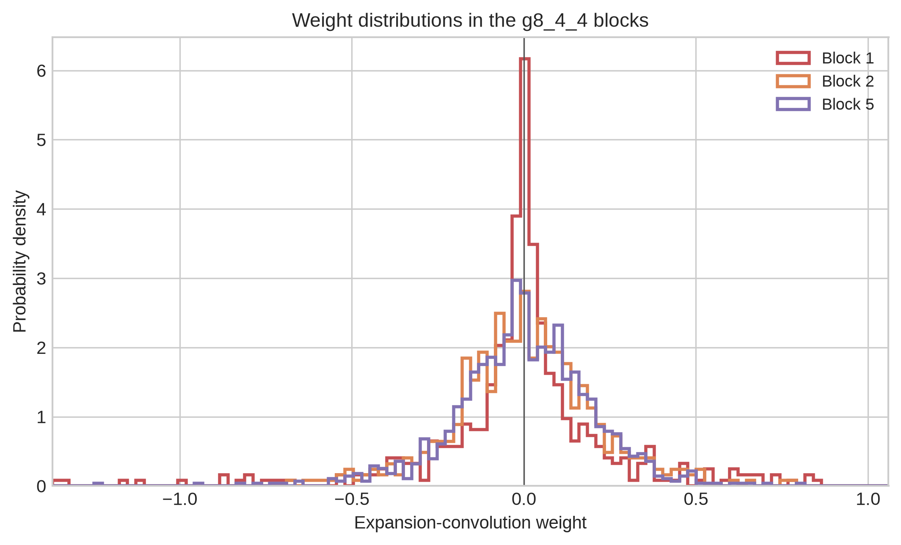
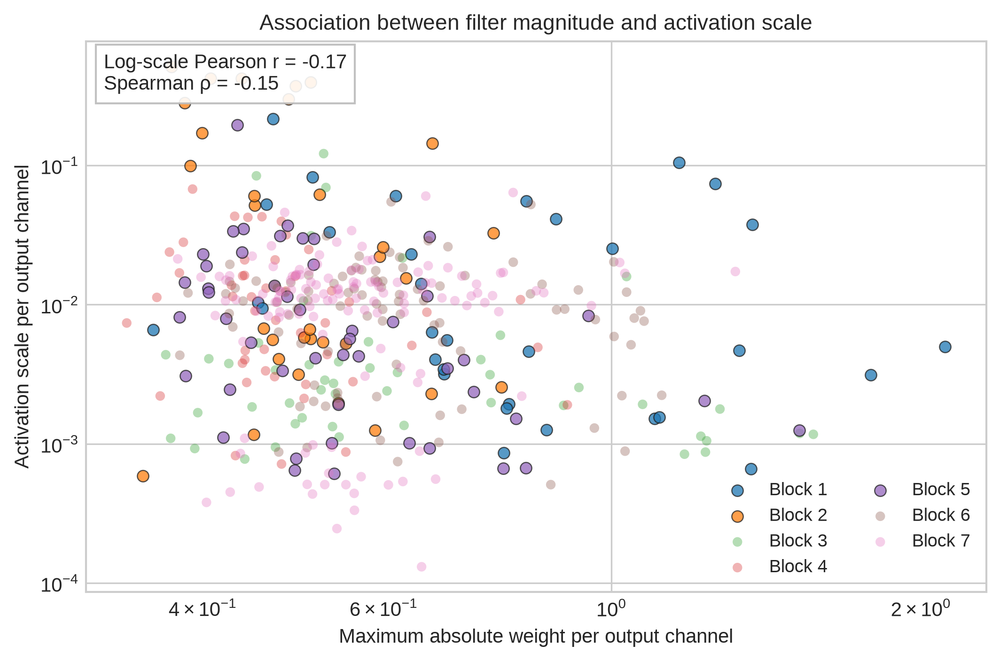
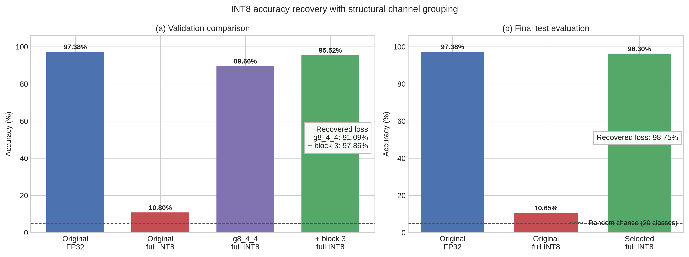
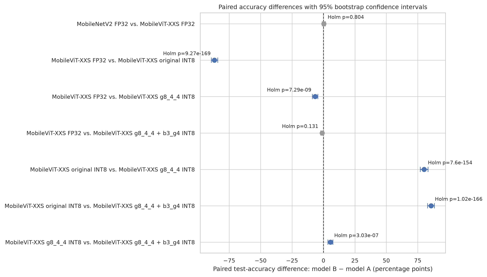

# Resumo

Este trabalho compara a CNN móvel MobileNetV2 à MobileViT-XXS, arquitetura híbrida com componentes *Vision Transformer*, e avalia sua inferência TFLite em um ESP32-S3. Utilizou-se o conjunto público *Butterflies-Austria-20*, com 6.479 imagens de 20 classes, dividido de forma estratificada. Os modelos pré-treinados foram ajustados sob o mesmo protocolo e convertidos pela pipeline PyTorch–LiteRT para TFLite INT8. O host preparou os tensores, processados no dispositivo com TensorFlow Lite Micro e núcleos ESP-NN compatíveis. Mediram-se acurácia, tempo de inferência e uso de memória pela arena de tensores. Em PyTorch, os modelos atingiram 97,07% e 97,22%. A MobileNetV2 INT8 preservou 97,22% e apresentou 3,27 s por `Invoke()`; a MobileViT-XXS INT8 caiu para 10,65%. O diagnóstico por canal relacionou o colapso à baixa resolução numérica de ativações heterogêneas sob uma escala compartilhada. O agrupamento estrutural de canais expôs escalas independentes ao quantizador. Exploratoriamente, a melhor de 17 variantes na validação atingiu 96,30% no teste sem retreinamento e 46,28 s por `Invoke()`. Como o teste já havia sido consultado, o resultado requer confirmação independente. Os tempos excluem aquisição, pré-processamento, comunicação e pós-processamento.

**Palavras-chave:** IA na borda; ESP32-S3; ESP-NN; MobileNetV2; MobileViT-XXS; quantização INT8.

# Introdução

Modelos de classificação executados próximos ao sensor podem reduzir comunicação, preservar privacidade e permitir funcionamento sem conectividade. Essa execução, entretanto, impõe restrições de memória, armazenamento, capacidade computacional e suporte de operadores. A escolha de uma arquitetura para IA na borda precisa considerar não apenas a qualidade preditiva, mas também a possibilidade de executar o artefato no dispositivo, sua robustez à quantização e seu tempo de inferência.

A MobileNetV2 foi projetada para reduzir o custo de redes convolucionais por meio de resíduos invertidos, gargalos lineares e convoluções separáveis em profundidade [1]. A MobileViT combina convoluções, que fornecem viés indutivo local, com blocos do tipo *transformer*, destinados a incorporar contexto global [2]. A comparação permite verificar, no mesmo ESP32-S3, os compromissos entre uma CNN móvel consolidada e popular e uma arquitetura híbrida com componentes de *Vision Transformer* e menor número de parâmetros.

O objetivo primário foi levar as duas pipelines até a execução embarcada, utilizando TensorFlow Lite Micro e as otimizações ESP-NN disponíveis, e medir acurácia, tempo de `Invoke()` e ocupação da arena de tensores. A representação *full INT8* foi definida como alvo de implantação desde o início do estudo. As versões FP32 e com pesos INT8 e ativações INT16 foram mantidas como controles para caracterizar os efeitos da conversão, e não como artefatos finais de implantação. Foi nesse processo que se identificou o colapso da MobileViT-XXS com ativações INT8. O diagnóstico e a tentativa de recuperação desse modelo constituem uma investigação adicional derivada do objetivo embarcado.

Para reduzir fatores de confusão, o estudo restringe o escopo a um conjunto de dados e a duas arquiteturas. MobileNetV2 e MobileViT-XXS utilizam pesos pré-treinados e o mesmo protocolo de ajuste fino. Não são incluídas outras variantes da MobileViT nem comparações de hardware realizadas sob runtimes distintos. O pré-processamento nativo de cada checkpoint foi preservado para não descaracterizar os modelos pré-treinados. Assim, os resultados comparam as configurações efetivamente implantadas de MobileNetV2 e MobileViT-XXS sob o mesmo protocolo experimental, reconhecendo que o pré-processamento específico de cada modelo integra sua configuração.

O estudo responde às seguintes questões:

1. Os modelos TFLite INT8 podem processar, no ESP32-S3, tensores pré-processados e quantizados pelo host, e quais são o tempo de `Invoke()` e a ocupação da arena de tensores?
2. Como uma CNN móvel consolidada e uma arquitetura híbrida com componentes *transformer* se comparam em qualidade preditiva, robustez à quantização e desempenho embarcado?
3. Que propriedade interna está associada ao colapso INT8 observado na MobileViT-XXS durante a preparação para implantação?
4. O agrupamento estrutural de canais recupera o desempenho sem novo treinamento e preserva a compatibilidade com o runtime embarcado?

As contribuições são:

- uma comparação embarcada entre uma CNN móvel consolidada e uma arquitetura híbrida sob a mesma divisão de dados e o mesmo protocolo de otimização;
- uma pipeline de PyTorch para TFLite INT8 por meio do LiteRT, seguida de implantação com TensorFlow Lite Micro e núcleos ESP-NN compatíveis;
- a execução dos modelos INT8 no ESP32-S3 sobre tensores de teste preparados pelo host, com medição do tempo de `Invoke()` e da ocupação da arena de tensores;
- a identificação e a análise por canal do colapso da MobileViT-XXS após a quantização das ativações para INT8;
- a avaliação controlada de uma transformação estrutural que mantém o checkpoint treinado e altera a granularidade efetiva da quantização;
- uma comparação de blocos e quantidades de grupos, com seleção pela validação e avaliação final da configuração escolhida.

# Fundamentação e trabalhos relacionados

## MobileNetV2

A MobileNetV2 conecta representações estreitas por atalhos residuais e realiza a transformação principal em um espaço expandido. Cada bloco expande os canais com uma convolução $1 \times 1$, aplica uma convolução *depthwise* e projeta o resultado de volta a um gargalo linear [1]. A separação entre transformação espacial e combinação de canais reduz o número de operações em relação a convoluções densas.

Arquiteturas posteriores, como a MobileNetV3, ampliaram esse projeto com busca de arquitetura e otimizações específicas para hardware móvel [3]. Neste estudo, a MobileNetV2 foi mantida como referência por sua implementação estável, ampla adoção e suporte consolidado à inferência inteira.

## MobileViT-XXS

A MobileViT intercala blocos residuais convolucionais e blocos MobileViT. Neles, características locais são extraídas por convoluções, reorganizadas em sequências de fragmentos e processadas por autoatenção. A variante XXS é a menor configuração da família original e procura combinar contexto global com baixo número de parâmetros [2].

A própria evolução MobileViTv2 substituiu a autoatenção multi-cabeças por atenção separável de complexidade linear para reduzir latência em dispositivos móveis [4]. Essa distinção é relevante aqui: a MobileViT-XXS possui menos parâmetros que a MobileNetV2, mas apresentou maior sensibilidade à quantização das ativações.

## Quantização para inferência inteira

A quantização mapeia valores reais para um conjunto discreto. Em uma quantização afim de 8 bits, uma aproximação de $x$ pode ser representada por

$$
q = \operatorname{clip}\left(\operatorname{round}\left(\frac{x}{s}\right)+z, q_{\min},q_{\max}\right),
$$

em que $s$ é a escala e $z$ é o ponto zero. A quantização de pesos e ativações permite inferência com aritmética inteira e reduz a ocupação do modelo [5]. A literatura distingue quantização pós-treinamento, aplicada a um modelo já treinado, e treinamento ciente de quantização, que simula os efeitos discretos durante o ajuste [6].

Neste trabalho, **resolução numérica** designa a capacidade da representação quantizada de distinguir valores próximos de uma ativação; ela não deve ser confundida com a resolução espacial da imagem. Em INT8 existem 256 valores inteiros possíveis, mas isso não significa que cada canal utilize todos eles. Quando uma ativação emprega uma única escala por tensor, canais com amplitudes muito diferentes competem pela mesma grade de quantização. Um canal extremo pode ampliar $s$, aumentar a distância entre valores reais representáveis e reduzir a resolução numérica efetivamente disponível para os canais menores. Este trabalho investiga esse mecanismo em vez de tratar a perda de acurácia somente como um resultado agregado.

Trabalhos específicos sobre quantização de *vision transformers* também relacionam a degradação a distribuições difíceis de representar. O PTQ4ViT identifica distribuições desequilibradas após Softmax e assimétricas após GELU, propondo quantização uniforme dupla e uma métrica orientada pela Hessiana para selecionar as escalas [7]. O RepQ-ViT identifica variação severa entre canais após LayerNorm e distribuições em lei de potência após Softmax; o método aplica quantizadores específicos durante a quantização e reparametriza suas escalas para formas mais adequadas à inferência em hardware [8]. A análise proposta neste artigo difere por localizar o problema nas expansões convolucionais de uma arquitetura híbrida MobileViT e por separar estruturalmente seus canais antes de aplicar uma receita INT8 convencional do LiteRT.

O MCUNet adota o coprojeto da arquitetura neural TinyNAS e do mecanismo de inferência TinyEngine para atender às restrições de memória, latência e energia de microcontroladores [9]. O MLPerf Tiny define uma suíte reproduzível de benchmarks que mede acurácia, latência e energia da inferência em sistemas TinyML [10]. Este trabalho avalia qualidade preditiva, tamanho dos arquivos, tempo de `Invoke()` e ocupação da arena de tensores no ESP32-S3; consumo de energia e latência ponta a ponta permanecem fora do escopo.

# Metodologia

## Conjunto de dados

O *Butterflies-Austria-20* reúne imagens RGB de borboletas em 20 categorias [11]. Sua escolha se deve à combinação de uma tarefa multiclasse de reconhecimento de espécies, relevante para monitoramento ambiental, com um volume de dados que permite ajustar os modelos e executar integralmente a partição de teste no ESP32-S3. O conjunto processado contém 6.479 imagens. A menor classe possui 160 imagens e a maior, 474, razão de 2,96 entre os extremos. A divisão estratificada é apresentada na Tabela 1.

*Tabela 1 — Divisão estratificada do conjunto de dados.*

| Partição | Imagens | Proporção |
|---|---:|---:|
| Treinamento | 5.183 | 80% |
| Validação | 648 | 10% |
| Teste | 648 | 10% |
| Total | 6.479 | 100% |

A separação foi materializada em disco no formato `partição/classe/imagem`, com estratificação por classe e semente 42. O mapeamento entre nomes e índices foi verificado nas três partições. A Tabela 2 detalha as contagens por classe.

*Tabela 2 — Distribuição das imagens por classe e partição.*

| Classe | Total | Treino | Validação | Teste |
|---|---:|---:|---:|---:|
| `Aglais_Urticae` | 269 | 215 | 27 | 27 |
| `Anthocharis_Cardamines` | 452 | 361 | 46 | 45 |
| `Apatura_Iris` | 349 | 279 | 35 | 35 |
| `Argynnis_Paphia` | 395 | 316 | 39 | 40 |
| `Colias_Myrmidone` | 284 | 227 | 29 | 28 |
| `Gonepteryx_Rhamni` | 232 | 186 | 23 | 23 |
| `Inachis_Io` | 273 | 218 | 27 | 28 |
| `Iphiclides_Podalirius` | 297 | 238 | 30 | 29 |
| `Lycaena_Virgaureae` | 171 | 137 | 17 | 17 |
| `Lycaenidae` | 415 | 332 | 42 | 41 |
| `Maniola_Jurtina` | 407 | 326 | 40 | 41 |
| `Melanargia_Galathea` | 410 | 328 | 41 | 41 |
| `Nymphalis_Antiopa` | 160 | 128 | 16 | 16 |
| `Papilio_Machaon` | 242 | 194 | 24 | 24 |
| `Parnassius_Apollo` | 309 | 247 | 31 | 31 |
| `Pieris_Rapae` | 368 | 294 | 37 | 37 |
| `Polygonia_C-album` | 396 | 317 | 39 | 40 |
| `Vanessa_Atalanta` | 474 | 379 | 48 | 47 |
| `Vanessa_Cardui` | 332 | 266 | 33 | 33 |
| `Zerynthia_Polyxena` | 244 | 195 | 24 | 25 |

A Figura 1 mostra a distribuição das classes no treinamento, enquanto as Figuras 2, 3 e 4 apresentam exemplos das partições de treinamento, teste e validação, respectivamente.



*Figura 1 — Distribuição das 20 classes na partição de treinamento.*


*Figura 2 — Exemplos de imagens da partição de treinamento.*


*Figura 3 — Exemplos de imagens da partição de teste.*


*Figura 4 — Exemplos de imagens da partição de validação.*

A distribuição e as amostras acima foram extraídas da pipeline da MobileNetV2 apenas para evitar figuras redundantes. As mesmas partições físicas de treinamento, validação e teste, com os mesmos arquivos e rótulos, foram utilizadas em todos os treinamentos e experimentos com MobileNetV2 e MobileViT-XXS. Somente o pré-processamento específico de cada checkpoint foi diferente.

## Protocolos comparados

A MobileNetV2 foi instanciada pela biblioteca `timm` como `mobilenetv2_100`, com pesos da ImageNet. A MobileViT-XXS utilizou o checkpoint `apple/mobilevit-xx-small`, também pré-treinado na ImageNet. Em ambos os casos, a camada classificadora foi substituída por uma saída de 20 logits e todo o modelo foi ajustado.

A seleção da MobileViT-XXS original também considerou a reprodutibilidade da pipeline de implantação. Essa variante dispunha de checkpoint pré-treinado, pré-processamento documentado e conversão funcional para TFLite no ambiente adotado. A MobileViTv2 foi avaliada preliminarmente, mas sua conversão direta apresentou incompatibilidades no LiteRT, incluindo falhas de *broadcasting* na atenção separável e geração de `STABLEHLO_SCATTER` durante a reconstrução dos fragmentos. Contornar essas limitações exigiria alterações específicas na implementação da arquitetura, introduzindo um fator adicional na comparação. A MobileViTv3 não foi incluída porque a versão do `timm` utilizada não oferecia uma implementação pré-treinada e mantida dessa família, nem havia uma pipeline equivalente validada para exportação direta ao LiteRT. Assim, a escolha da MobileViT-XXS priorizou disponibilidade de pesos, pré-processamento reproduzível e compatibilidade com o fluxo de implantação empregado. A Tabela 3 resume as características das duas pipelines.

*Tabela 3 — Características das pipelines comparadas.*

| Característica | MobileNetV2 | MobileViT-XXS |
|---|---:|---:|
| Parâmetros | 2.249.492 | 957.444 |
| Entrada | $224 \times 224$ | $256 \times 256$ |
| Canais | RGB normalizado pela ImageNet | BGR reescalado para $[0,1]$, sem normalização por média e desvio-padrão |
| Pré-treinamento | ImageNet | ImageNet |
| *Dropout* do classificador | 0,3 | 0,3 |

A resolução e a normalização não foram igualadas porque cada checkpoint foi mantido com seu pré-processamento esperado. Essa decisão preserva a validade de cada pipeline pré-treinada, mas limita qualquer atribuição de diferenças exclusivamente à arquitetura.

A ordem BGR não foi uma escolha empírica nem uma inversão acidental dos canais. A documentação oficial da variante XXS especifica: “Pixels are normalized to the range [0, 1]. Images are expected to be in BGR pixel order, not RGB”. A configuração do processador associada ao checkpoint `apple/mobilevit-xx-small` também define `do_flip_channels=true`, redimensionamento para 288 pixels e recorte central de $256 \times 256$ [12]. Na implementação, `ToTensor()` converte os pixels de 8 bits para ponto flutuante e os reescala de $[0,255]$ para $[0,1]$; em seguida, a indexação `image[[2, 1, 0]]` transforma a ordem RGB fornecida pelo carregador em BGR. Não foi aplicada normalização pela média e pelo desvio-padrão da ImageNet à MobileViT-XXS, pois ela não pertence ao pré-processamento esperado por esse checkpoint. Portanto, as resoluções de entrada, a ordem dos canais e a normalização adotadas seguem as configurações estabelecidas para cada modelo pré-treinado.

No treinamento, ambas receberam inversões horizontal e vertical com probabilidade 0,1 e transformação afim com rotação de até 10 graus, translação de até 10% e escala entre 0,9 e 1,1. A MobileViT-XXS redimensionou a imagem para 288 pixels antes de um recorte aleatório de $256 \times 256$; validação e teste utilizaram recorte central. Validação, teste e calibração não receberam aumento aleatório.

O desbalanceamento foi tratado por entropia cruzada ponderada. Os pesos foram obtidos pela raiz quadrada do inverso da frequência de cada classe e normalizados para média um. Foi utilizado *label smoothing* de 0,05.

## Otimização

Os dois modelos utilizaram AdamW, decaimento de pesos de $10^{-4}$, limitação da norma do gradiente em 1,0 e escalonamento One-Cycle. A taxa máxima foi $10^{-4}$ para o *backbone* e $10^{-3}$ para o classificador. O limite foi de 40 épocas, com interrupção após oito épocas sem melhora estrita da acurácia de validação. O estado com maior acurácia de validação foi restaurado antes do teste.

A semente 42 foi aplicada a Python, NumPy e PyTorch.

## Conversão e avaliação

O treinamento e o ajuste fino foram realizados com PyTorch 2.10.0+cu128. Para a implantação, foi desenvolvida uma pipeline que carrega os checkpoints PyTorch, adapta os modelos para exportação e os converte diretamente para o formato TFLite com `litert_torch.convert`, fornecido pelo LiteRT-Torch 0.9.4. Os arquivos TFLite FP32 resultantes foram calibrados e quantizados com AI Edge Quantizer 0.9.0, e os artefatos finais foram executados com `ai_edge_litert.Interpreter`, do AI Edge LiteRT 2.2.0. Assim, o fluxo experimental permaneceu no ecossistema PyTorch–LiteRT, sem uso direto das APIs Python do TensorFlow para treinamento, conversão ou inferência.

A versão *full INT8* foi o alvo da implantação no ESP32-S3, de acordo com o objetivo de avaliar inferência inteira no TensorFlow Lite Micro e aproveitar os núcleos ESP-NN compatíveis. As representações FP32 e INT8A16 foram utilizadas como controles experimentais para separar perdas causadas pela conversão das associadas especificamente à quantização das ativações para 8 bits.

Para cada arquitetura, foram produzidas e avaliadas três representações:

- FP32;
- pesos INT8 e ativações INT16, denominada INT8A16;
- pesos e ativações INT8, denominada *full INT8*.

Neste artigo, MB é empregado exclusivamente no sentido decimal, com $1\ \mathrm{MB}=10^6$ bytes. Os tamanhos dos arquivos foram obtidos em bytes e somente então convertidos para MB; os percentuais de variação foram calculados com os valores exatos, antes do arredondamento apresentado nas tabelas.

A calibração inicial de cada arquitetura utilizou exatamente 100 imagens exclusivas da partição de treinamento, selecionadas sem reposição por `torch.randperm` sobre os índices do `ImageFolder`, com semente 42. Como treinamento, validação e teste foram materializados em diretórios distintos, não houve sobreposição entre as amostras de calibração e as partições de avaliação. As imagens receberam o pré-processamento determinístico específico de cada modelo, sem aumento aleatório. A pipeline implementada automatizou a preparação dos dados de calibração, a aplicação das receitas de quantização estática, a inspeção dos tipos de entrada e saída e a avaliação dos modelos TFLite no conjunto de teste. A avaliação em PyTorch incluiu acurácia, precisão, *recall* e F1 macro e ponderados. Diferenças equivalentes a uma ou poucas imagens são reportadas como variação discreta e não como ganho estatístico.

## Diagnóstico do colapso da MobileViT-XXS

Uma segunda etapa utilizou exatamente 1.000 imagens distintas da mesma partição de treinamento, com 50 exemplos por classe, selecionadas sem reposição por `torch.randperm` aplicado aos índices de cada classe, com semente 42. A lista ordenada dos caminhos foi registrada em `calibration_manifest.csv`. O mesmo conjunto foi empregado tanto na medição das ativações quanto na quantização de todas as variantes estruturais, sem participação de imagens de validação ou teste e sem aumento aleatório.

O *forward hook* foi registrado diretamente no módulo completo `block.expand_1x1`, e não apenas em sua convolução interna. Esse módulo executa, nessa ordem, convolução $1\times1$, BatchNorm e ativação; logo, o tensor FP32 registrado corresponde à saída após a ativação e imediatamente antes da convolução *depthwise* $3\times3$. Seja $x_{i,c,u,v}$ essa saída para a imagem de calibração $i$, o canal $c$ e a posição espacial $(u,v)$. Os extremos e a amplitude observada do canal foram definidos por

$$
m_c^- = \min_{i,u,v}x_{i,c,u,v},\qquad
m_c^+ = \max_{i,u,v}x_{i,c,u,v},\qquad
\Delta_c=m_c^+-m_c^-.
$$

As escalas diagnósticas estimadas por canal e para o tensor completo foram

$$
\widehat{s}_c=\max\left(\frac{\Delta_c}{255},\varepsilon\right),
$$

$$
\Delta_T=\max_c m_c^+-\min_c m_c^-,\qquad
\widehat{s}_T=\max\left(\frac{\Delta_T}{255},\varepsilon\right),
$$

em que $\varepsilon$ é o épsilon de máquina utilizado na implementação em `float32`. A razão apresentada por bloco foi calculada explicitamente como

$$
\widehat{R}=\frac{\max_c\widehat{s}_c}{\min_c\widehat{s}_c}.
$$

O uso de $\varepsilon$ evita divisão por zero caso algum canal tenha amplitude nula; nenhum canal analisado apresentou $\Delta_c=0$. O intervalo diagnóstico foi a amplitude efetivamente observada $[m_c^-,m_c^+]$: o zero pertence a ele somente quando $m_c^-\leq0\leq m_c^+$, sem expansão artificial dos extremos. Essa definição deve ser distinguida da calibração afim do quantizador, que pode ajustar a faixa para representar o zero.

Os símbolos $\widehat{s}_c$ e $\widehat{s}_T$ representam estimativas calculadas sobre ativações FP32 do modelo PyTorch. Eles não são a escala interna $s_T^{\mathrm{TFLite}}$ nem o ponto zero armazenados no FlatBuffer. Como a conversão pode fundir ou reorganizar operações, a fronteira observada pelo *hook* não necessariamente permanece como um tensor independente no grafo TFLite. Assim, a análise caracteriza a heterogeneidade anterior à exportação e sua associação com o colapso, mas não afirma equivalência direta com os parâmetros internos produzidos pelo quantizador.

O tipo INT8 oferece 256 valores inteiros, de −128 a 127. Quando a escala é compartilhada, esses 256 níveis de quantização precisam cobrir a faixa completa $\Delta_T$. Um canal cuja faixa $\Delta_c$ seja muito menor utiliza somente uma parte dessa grade. Para estimar sua resolução numérica efetiva, foi calculado o número aproximado de níveis de quantização efetivos:

$$
L_c=\min\left(256,\left\lfloor\frac{\Delta_c}{\widehat{s}_T}\right\rfloor+1\right).
$$

O valor $L_c$ estima quantos passos da grade INT8 compartilhada cabem na faixa observada do canal. Ele não representa memória reservada, quantidade de imagens, número de ativações processadas nem uma contagem direta dos valores inteiros que ocorreram durante a inferência. Trata-se de uma medida aproximada da resolução numérica disponível para representar aquele canal.

Por exemplo, considere um tensor com faixa conjunta de 25,5. Sua escala diagnóstica compartilhada será $\widehat{s}_T=25,5/255=0,1$. Se determinado canal variar apenas de 0 a 1,5, sua faixa será 1,5 e sua resolução numérica efetiva aproximada será

$$
L_c=\left\lfloor\frac{1,5}{0,1}\right\rfloor+1=16.
$$

Embora o tipo INT8 possua 256 valores possíveis, esse canal utilizará aproximadamente 16 níveis para representar toda a sua variação. Valores reais próximos serão arredondados para o mesmo nível, aumentando o erro de quantização e eliminando variações presentes em ponto flutuante.

Para resumir cada bloco, foram calculadas a mediana de $L_c$ e as quantidades de canais com no máximo 16 ou 32 níveis efetivos. Neste trabalho, valores de até 32 indicam baixa utilização da faixa compartilhada, enquanto valores de até 16 foram tratados como compressão severa. Esses limiares são critérios descritivos para comparar os blocos neste experimento, não limites universais de falha.

A razão entre a maior e a menor escala diagnóstica de canal e a distribuição de $L_c$ fornecem informações complementares. A razão detecta heterogeneidade extrema e pode ser dominada por poucos valores atípicos. A distribuição dos níveis efetivos indica a extensão do problema, isto é, quantos canais perdem resolução numérica sob a escala compartilhada estimada. Uma mediana de seis níveis, como a observada no bloco 3, significa que pelo menos metade de seus canais dispõe de aproximadamente seis níveis de quantização ou menos segundo essa aproximação.

Como diagnóstico complementar, relacionou-se, para cada canal de saída, a maior magnitude absoluta dos pesos da convolução de expansão à escala da ativação correspondente. A associação foi quantificada pela correlação de Pearson entre os logaritmos das duas grandezas e pela correlação de postos de Spearman sobre seus valores originais. Essa análise foi descritiva e não foi usada isoladamente para selecionar os blocos.

## Agrupamento estrutural de canais

### Definição de bloco

Neste experimento, “bloco” designa uma instância de `MobileViTInvertedResidual`. Não se refere a um bloco de imagens nem a um *batch*. Cada módulo possui a seguinte sequência:

```text
entrada
  │
  ├─ convolução 1×1 de expansão
  ├─ BatchNorm e ativação
  ├─ convolução 3×3 depthwise
  ├─ BatchNorm e ativação
  ├─ convolução 1×1 de redução
  ├─ BatchNorm
  └─ conexão residual, quando aplicável
```

Foram identificados sete módulos desse tipo, numerados de 1 a 7 conforme sua ordem de execução na rede. O diagnóstico por canal foi realizado na saída da convolução de expansão `expand_1x1` de cada módulo.

### Notação e configurações de referência

As configurações estruturais foram identificadas pelos blocos transformados e por suas respectivas quantidades de grupos. A configuração `g8_4_4` foi a primeira a demonstrar recuperação ampla e aplicou 8, 4 e 4 grupos aos blocos 1, 2 e 5, respectivamente. Ela foi utilizada como referência inicial para construir e comparar novas variantes. A configuração `g8_4_4 + b3_g4` preservou esses agrupamentos e acrescentou o bloco 3 dividido em quatro grupos; ao final da avaliação comparativa, ela foi selecionada pela acurácia de validação. A Tabela 4 resume os agrupamentos das duas configurações de referência.

```python
INITIAL_GROUP_COUNTS = {
    1: 8,
    2: 4,
    5: 4,
}

SELECTED_GROUP_COUNTS = {
    1: 8,
    2: 4,
    3: 4,
    5: 4,
}
```

*Tabela 4 — Agrupamentos das configurações de referência.*

| Papel na avaliação | Bloco | Canais internos | Grupos | Canais por grupo |
|---|---:|---:|---:|---:|
| Configuração inicial | 1 | 32 | 8 | 4 |
| Configuração inicial | 2 | 32 | 4 | 8 |
| Configuração inicial | 5 | 48 | 4 | 12 |
| Extensão selecionada | 3 | 48 | 4 | 12 |

Um grupo é um subconjunto dos canais internos de um bloco. Não corresponde a uma divisão das imagens, das classes ou do lote, e também não é uma convolução agrupada tradicional. A transformação cria ramificações explícitas no grafo.

### Formação dos grupos

Durante a calibração, foram registrados o mínimo e o máximo da saída de `expand_1x1` para cada canal. A escala foi estimada por

```text
channel_range = maximum - minimum
channel_scale = channel_range / 255
```

Em cada bloco selecionado, os índices dos canais foram ordenados por `channel_scale` e a sequência ordenada foi dividida em grupos de tamanhos semelhantes:

```python
ordered_channels = torch.argsort(scales_by_block[block_index])
groups = torch.tensor_split(ordered_channels, group_count)
```

Portanto, cada grupo reúne canais com amplitudes aproximadamente semelhantes. Os índices não precisam ser consecutivos. Em um exemplo simplificado:

```text
canal 3: escala 0,001
canal 7: escala 0,002
canal 1: escala 0,030
canal 5: escala 0,035

grupo 1: canais [3, 7]
grupo 2: canais [1, 5]
```

### Transformação do bloco

O bloco original processava todos os canais internos no mesmo caminho:

```text
entrada
  └─ expansão com C canais
       └─ depthwise com C canais
            └─ redução
```

Após a transformação, cada grupo passou a ser processado por uma ramificação independente:

```text
                    ┌─ grupo 1 ─ expansão ─ depthwise ─ redução ─┐
                    ├─ grupo 2 ─ expansão ─ depthwise ─ redução ─┤
entrada ────────────┼─ ...                                       ├─ soma ─ residual
                    └─ grupo G ─ expansão ─ depthwise ─ redução ─┘
```

Em cada ramificação:

1. a expansão conserva somente os filtros que produzem os canais do grupo;
2. a convolução *depthwise* conserva os mesmos canais;
3. a redução conserva somente as colunas de pesos associadas a esses canais;
4. a redução continua produzindo o número original de canais de saída;
5. as saídas das ramificações são somadas;
6. a conexão residual é aplicada uma única vez, depois da soma.

### Reconstrução da saída

A convolução de redução combina linearmente os canais internos. Para um canal de saída $o$, sua operação pode ser representada por

$$
y_o=\sum_{c=1}^{C}W_{o,c}h_c+b_o,
$$

em que $h_c$ é a saída do caminho de expansão e *depthwise* no canal $c$. Particionando os canais em $G$ grupos disjuntos,

$$
y_o=\sum_{g=1}^{G}\left(\sum_{c\in g}W_{o,c}h_c+\frac{b_o}{G}\right).
$$

Antes da divisão, a BatchNorm da redução foi incorporada aos pesos e ao bias da convolução. Cada ramificação recebeu $b_o/G$; portanto, a soma das $G$ parcelas reconstrói um único bias $b_o$. Essa decomposição mantém os pesos aprendidos e a função algébrica do bloco. Pequenas diferenças FP32 podem permanecer devido à alteração da ordem das somas em ponto flutuante.

### Efeito sobre a quantização

No bloco original, todos os 32 ou 48 canais internos formavam um único tensor e compartilhavam uma escala de ativação INT8. Um canal extremo podia determinar essa escala e deixar poucos níveis de quantização efetivos para canais menores.

Com o agrupamento, cada ramificação expõe um tensor intermediário próprio ao quantizador:

```text
grupo 1 → tensor 1 → escala INT8 própria
grupo 2 → tensor 2 → escala INT8 própria
...
grupo G → tensor G → escala INT8 própria
```

O quantizador continua aplicando quantização por tensor, mas agora dentro de conjuntos de canais com amplitudes semelhantes. Isso reduz a competição entre canais grandes e pequenos e aumenta a resolução numérica efetiva ao melhorar a utilização dos 256 valores representáveis em INT8. No bloco 2, por exemplo, a razão entre a maior e a menor escala diagnóstica estimada era aproximadamente 874,36×; sua separação em quatro ramificações reduziu a heterogeneidade dentro de cada tensor quantizado.

A transformação mantém os pesos aprendidos. Nenhum novo treinamento ou QAT foi realizado.

## Protocolo de avaliação das variantes estruturais

Uma etapa posterior comparou 17 configurações sob o mesmo checkpoint, as mesmas 1.000 imagens estratificadas de calibração, o mesmo quantizador e a mesma partição de validação. O objetivo foi determinar quais blocos e interações contribuem para a recuperação, avaliar o efeito da quantidade de grupos e verificar se a extensão da configuração inicial com os blocos 3 ou 7 produzia ganhos adicionais.

Foram avaliados os blocos 1, 2, 3, 5 e 7 isoladamente; combinações parciais dos blocos 1, 2 e 5; variações de 2, 4 e 8 grupos; uma configuração uniforme; a configuração inicial `g8_4_4`; e duas extensões que acrescentaram os blocos 3 ou 7. Todas as variantes foram exportadas e avaliadas como TFLite INT8 real. Desse modo, a escolha final resultou da comparação sistemática das alternativas, e não da adoção prévia de um agrupamento fixo.

A preservação FP32 foi verificada para cada transformação pela concordância top-1 e pelo erro absoluto máximo entre os logits do modelo original e do modelo agrupado. Essa verificação teve caráter diagnóstico e não foi usada como critério obrigatório de elegibilidade na avaliação comparativa: variantes exportadas e avaliadas com sucesso permaneceram na comparação mesmo quando não atingiram os limites de concordância top-1 mínima de 99,8% e erro máximo de logits de 0,05. A configuração selecionada para o teste atingiu 99,85% de concordância top-1 e erro absoluto máximo de 0,0395, portanto passou pelos dois limites configurados.

A configuração levada ao teste foi escolhida exclusivamente pela acurácia de validação. Variantes com diferença de até uma imagem em relação à melhor acurácia seriam desempatadas pelo menor número de ramificações adicionais, menor tamanho e menor número de operadores. Somente a configuração selecionada por essa regra foi avaliada no teste nessa etapa. A escolha do maior resultado entre 17 alternativas pode produzir otimismo de seleção na própria validação. Como a partição de teste já havia sido consultada nos experimentos anteriores, esse resultado é tratado como evidência exploratória, e não como confirmação em um conjunto completamente cego.

## Análise estatística pareada

Para as comparações pareadas posteriores, as predições dos modelos incluídos em cada contraste foram registradas para as mesmas 648 imagens de teste, preservando a mesma ordem. A incerteza da acurácia individual foi representada por intervalos de confiança de 95% de Wilson, apropriados para proporções binomiais. Para cada diferença de acurácia, também foi calculado um intervalo de 95% por *bootstrap* pareado com 10.000 reamostragens e semente 42. O pareamento preserva, em cada reamostragem, as predições dos dois modelos para a mesma imagem e foi usado para descrever a magnitude e a incerteza da diferença observada.

O teste exato bilateral de McNemar foi adotado como análise inferencial principal porque compara dois classificadores avaliados sobre as mesmas amostras. Para cada par, as predições foram reduzidas a acerto ou erro e organizadas em uma tabela $2\times2$. O teste considera somente os casos discordantes: imagens acertadas apenas pelo modelo A e imagens acertadas apenas pelo modelo B. A hipótese nula estabelece que essas duas frequências são iguais. A versão exata binomial foi usada por permanecer válida quando há poucos pares discordantes.

Foram planejadas sete comparações. Seus valores de $p$ foram ajustados pelo procedimento de Holm para controlar em 5% a probabilidade de ao menos um falso positivo no conjunto de comparações. O teste foi calculado inicialmente com `scipy.stats.binomtest` e verificado de forma independente com `statsmodels.stats.contingency_tables.mcnemar`; as duas implementações produziram os mesmos valores de $p$. Ausência de significância foi interpretada como falta de evidência de diferença, e não como demonstração de equivalência.

## Protocolo de execução no ESP32-S3

A execução embarcada constituiu o objetivo central da comparação. Foi usado um ESP32-S3 DevKitC-1 com módulo N16R8, CPU configurada a 240 MHz, 16.777.216 bytes de memória flash (16,78 MB) e 8.388.608 bytes de PSRAM octal (8,39 MB) a 80 MHz. Os três firmwares foram construídos com ESP-IDF 5.5.0 e o mesmo componente TensorFlow Lite Micro, compilado com os núcleos otimizados do ESP-NN v1.1.2 para operações como convolução, convolução *depthwise*, soma, multiplicação, *pooling*, camada totalmente conectada e Softmax. A partição LittleFS possuía 10.354.688 bytes (10,35 MB). A arena de tensores foi limitada a 5.242.880 bytes (5,24 MB) e alocada na PSRAM. Os modelos foram copiados do LittleFS para a PSRAM durante a inicialização e executados por um `MicroInterpreter` com apenas os operadores necessários a cada grafo. O valor retornado por `arena_used_bytes()` representa somente a ocupação da arena de tensores; não corresponde ao pico total de RAM e não inclui pilha, heap externo à arena, buffers de comunicação, estruturas externas do interpretador nem outros custos do firmware.

Foram embarcados três modelos *full INT8*: MobileNetV2, MobileViT-XXS `g8_4_4` e MobileViT-XXS `g8_4_4 + b3_g4`. Para resolver a incompatibilidade entre o grafo produzido pelo *pooling* global da MobileNetV2 e os operadores aceitos pelo runtime embarcado, a cópia destinada à exportação expressou essa operação como `AVERAGE_POOL_2D` com janela $7\times7$. Essa substituição apresentou erro absoluto máximo de $2,384\times10^{-7}$ em relação ao modelo PyTorch original e não alterou o checkpoint treinado. Após a adaptação e a incorporação dos buffers ao FlatBuffer, o artefato embarcado possuía 2.809.720 bytes, enquanto a conversão inicial possuía 2.813.232 bytes. A identidade dos três arquivos executados no dispositivo foi conferida por SHA-256 contra os artefatos avaliados no host.

O conjunto completo de 648 imagens de teste foi percorrido na mesma ordem. O host realizou o pré-processamento específico de cada modelo, quantizou a entrada e enviou o tensor INT8 NCHW por HTTP. O firmware conferiu o tamanho e o hash FNV-1a da entrada, copiou os dados para o tensor, executou `MicroInterpreter::Invoke()`, desquantizou os 20 logits e aplicou `argmax`. Portanto, o tempo reportado como inferência foi medido por `esp_timer_get_time()` ao redor de `Invoke()` no próprio dispositivo e não inclui redimensionamento, normalização, quantização no host, transmissão pela rede, cópia da entrada ou pós-processamento. Foram realizadas três inferências de aquecimento para a MobileNetV2 e uma para cada MobileViT; em seguida, as 648 invocações foram usadas no cálculo de média, desvio-padrão, mediana e percentil 95. A arena efetivamente usada foi obtida de `arena_used_bytes()`.

# Resultados

## Desempenho em PyTorch

Os dois modelos atingiram sua melhor acurácia de validação na época 26 e foram interrompidos na época 34. A diferença de acurácia no teste foi 0,15 ponto percentual, correspondente a uma única imagem. As métricas são apresentadas na Tabela 5.

*Tabela 5 — Desempenho dos modelos PyTorch na partição de teste.*

| Modelo | Parâmetros totais | Acurácia | Precisão macro | Recall macro | F1 macro | F1 ponderado |
|---|---:|---:|---:|---:|---:|---:|
| MobileNetV2 | 2.249.492 | 97,07% | 97,13% | 96,98% | 97,00% | 97,08% |
| MobileViT-XXS | 957.444 | 97,22% | 97,27% | 97,31% | 97,21% | 97,22% |

A MobileViT-XXS alcançou desempenho semelhante com 57,4% menos parâmetros. As curvas de treinamento são apresentadas nas Figuras 5 e 8; as Figuras 6 e 9 mostram exemplos de predições; e as Figuras 7 e 10 apresentam as matrizes de confusão.

### MobileNetV2



*Figura 5 — Evolução da perda e da acurácia de treinamento e validação da MobileNetV2.*


*Figura 6 — Exemplos de predições da MobileNetV2 na partição de teste. Títulos verdes indicam acertos e títulos vermelhos indicam erros.*



*Figura 7 — Matriz de confusão da MobileNetV2 na partição de teste.*

### MobileViT-XXS



*Figura 8 — Evolução da perda e da acurácia de treinamento e validação da MobileViT-XXS.*


*Figura 9 — Exemplos de predições da MobileViT-XXS na partição de teste. Títulos verdes indicam acertos e títulos vermelhos indicam erros.*



*Figura 10 — Matriz de confusão da MobileViT-XXS na partição de teste.*

## Conversão e quantização

Os resultados das três representações de cada arquitetura são apresentados na Tabela 6.

*Tabela 6 — Resultados da conversão inicial para TFLite, calibrada com 100 imagens.*

| Pipeline e representação | Tamanho decimal (bytes exatos) | Acurácia de teste | Diferença para FP32 |
|---|---:|---:|---:|
| MobileNetV2 TFLite FP32 | 9,04 MB (9.044.328 B) | 97,07% | — |
| MobileNetV2 pesos INT8/ativações INT16 | 2,88 MB (2.881.680 B) | 97,22% | +0,15 p.p. |
| MobileNetV2 pesos INT8/ativações INT8 — conversão inicial | 2,81 MB (2.813.232 B) | 97,22% | +0,15 p.p. |
| MobileViT-XXS TFLite FP32 | 4,54 MB (4.543.596 B) | 97,38% | — |
| MobileViT-XXS pesos INT8/ativações INT16 | 1,98 MB (1.982.912 B) | 96,76% | −0,62 p.p. |
| MobileViT-XXS pesos INT8/ativações INT8 — conversão inicial | 1,91 MB (1.914.080 B) | 9,57% | −87,81 p.p. |

Na MobileNetV2, tanto a versão INT8A16 quanto a versão *full INT8* alcançaram 97,22% de acurácia, ante 97,07% do modelo TFLite FP32. Essa variação de +0,15 ponto percentual equivale a uma imagem e não demonstra melhoria de generalização; o resultado relevante é a ausência de degradação mensurável após a redução de 9,04 MB para 2,81 MB.

Na MobileViT-XXS, a versão INT8A16 preservou 96,76% de acurácia, uma redução de 0,62 ponto percentual em relação aos 97,38% do TFLite FP32. Em contraste, a versão *full INT8* atingiu apenas 9,57% de acurácia, queda de 87,81 pontos percentuais, e obteve F1 ponderado de 5,11%. Como os pesos permanecem INT8 nas duas versões, a diferença entre INT8A16 e *full INT8* indica que o colapso está associado à redução das ativações de 16 para 8 bits.

Essa conversão inicial utilizou 100 imagens de calibração. Na etapa controlada posterior, a MobileViT-XXS sem agrupamento foi reexportada com *average pooling* fixo de $8\times8$, buffers incorporados ao FlatBuffer e 1.000 imagens estratificadas de calibração. Esse artefato distinto possuía 1.730.472 bytes e atingiu 10,80% na validação e 10,65% no teste. A mudança da pipeline de exportação e do conjunto de calibração não eliminou o colapso.

## Evidências do colapso INT8

A Tabela 7 resume a heterogeneidade das ativações observada nos sete blocos.

*Tabela 7 — Heterogeneidade diagnóstica das ativações FP32 por bloco.*

| Bloco | Canais | Razão entre escalas diagnósticas $\widehat{R}$ | Mediana de níveis efetivos | Canais com até 16 níveis efetivos | Fração do bloco |
|---|---:|---:|---:|---:|---:|
| 1 | 32 | 327,61× | 8,0 | 19 | 59,4% |
| 2 | 32 | 874,36× | 10,0 | 18 | 56,3% |
| 3 | 48 | 156,28× | 6,0 | 41 | 85,4% |
| 4 | 48 | 94,35× | 37,5 | 13 | 27,1% |
| 5 | 48 | 318,00× | 8,5 | 32 | 66,7% |
| 6 | 96 | 107,49× | 49,5 | 19 | 19,8% |
| 7 | 128 | 487,58× | 47,0 | 27 | 21,1% |

Os blocos 1, 2 e 5 combinam razões elevadas com uma parcela relevante de canais usando poucos níveis de quantização efetivos e fundamentaram a configuração inicial. O bloco 3 apresenta o comprometimento mais disseminado: 85,4% de seus canais dispõem de até 16 níveis efetivos e a mediana é de seis. O bloco 7 apresenta a segunda maior razão entre escalas, mas somente 21,1% de seus canais estão abaixo desse limite e sua mediana é de 47 níveis. Portanto, a razão extrema isolada não foi suficiente para definir a transformação; a escolha final também considerou a prevalência da compressão e os resultados das variantes combinadas. A Figura 11 compara as escalas e a resolução numérica efetiva antes e depois do agrupamento.



*Figura 11 — Diagnóstico das ativações na calibração. À esquerda, razão entre a maior e a menor escala diagnóstica estimada dos canais em cada bloco. À direita, mediana estimada dos níveis efetivos antes e depois dos agrupamentos estruturais. Ambas as medidas derivam das ativações FP32 observadas no PyTorch, não das escalas internas do FlatBuffer.*

A distribuição dos pesos de expansão dos blocos 1, 2 e 5, destacados pelo diagnóstico inicial e posteriormente avaliados em diferentes combinações e quantidades de grupos, é apresentada na Figura 12. A Figura 13 amplia a análise para os sete blocos e mostra uma associação global fraca entre a maior magnitude absoluta dos pesos de cada filtro e a escala de sua ativação: Pearson em escala logarítmica de −0,17 e Spearman de −0,15. Assim, a magnitude dos pesos, isoladamente, não explica a heterogeneidade das ativações observada na calibração.



*Figura 12 — Distribuições dos pesos da convolução de expansão nos blocos 1, 2 e 5, destacados pelo diagnóstico inicial e avaliados em diferentes configurações estruturais.*



*Figura 13 — Relação, por canal de saída, entre a maior magnitude absoluta dos pesos do filtro de expansão e a escala da ativação correspondente. Ambos os eixos estão em escala logarítmica.*

## Avaliação comparativa das variantes estruturais

Para evitar selecionar antecipadamente uma configuração específica, as 17 variantes foram comparadas primeiro na partição de validação, sob o mesmo checkpoint, o mesmo conjunto estratificado de calibração e o mesmo quantizador. A Tabela 8 inclui transformações de blocos isolados, combinações parciais, diferentes quantidades de grupos e extensões com os blocos 3 e 7.

*Tabela 8 — Comparação das 17 configurações estruturais INT8 na validação.*

| Configuração INT8 | Blocos e grupos | Acurácia de validação | F1 macro |
|---|---|---:|---:|
| `b1_g8` | 1:8 | 18,21% | 12,26% |
| `b2_g4` | 2:4 | 37,81% | 35,41% |
| `b3_g4` | 3:4 | 11,42% | 4,60% |
| `b5_g4` | 5:4 | 10,96% | 7,29% |
| `b7_g8` | 7:8 | 12,50% | 8,28% |
| `b1_g8_b2_g4` | 1:8; 2:4 | 66,36% | 64,58% |
| `b1_g8_b5_g4` | 1:8; 5:4 | 22,69% | 20,20% |
| `b2_g4_b5_g4` | 2:4; 5:4 | 72,84% | 70,89% |
| `g4_4_4` | 1:4; 2:4; 5:4 | 89,81% | 89,52% |
| `g8_2_4` | 1:8; 2:2; 5:4 | 89,51% | 89,54% |
| `g8_4_4` | 1:8; 2:4; 5:4 | 89,66% | 89,59% |
| `g8_8_4` | 1:8; 2:8; 5:4 | 89,35% | 89,26% |
| `g8_4_2` | 1:8; 2:4; 5:2 | 89,51% | 89,30% |
| `g8_4_8` | 1:8; 2:4; 5:8 | 90,12% | 89,91% |
| `g8_8_8` | 1:8; 2:8; 5:8 | 88,73% | 88,60% |
| `g8_4_4 + b3_g4` | 1:8; 2:4; 3:4; 5:4 | **95,52%** | **95,42%** |
| `g8_4_4 + b7_g8` | 1:8; 2:4; 5:4; 7:8 | 90,12% | 90,16% |

Os experimentos isolados não recuperaram o modelo. O bloco 2 apresentou o maior efeito individual, com 37,81%, mas permaneceu muito abaixo do FP32. Tomando a configuração inicial como referência controlada, sua execução sem o bloco 1 reduziu a acurácia em 16,82 pontos percentuais; sem o bloco 2, a queda foi de 66,98 pontos; e sem o bloco 5, de 23,30 pontos. Portanto, os blocos 1, 2 e 5 contribuem conjuntamente, com papel especialmente crítico do bloco 2.

A quantidade de grupos não apresentou relação monotônica com a acurácia. A configuração `g4_4_4` superou a configuração inicial por uma imagem e utilizou menos ramificações, enquanto `g8_8_8` ficou 0,93 ponto percentual abaixo. Aumentar o bloco 5 de quatro para oito grupos produziu ganho de apenas três imagens. Essas diferenças pequenas não sustentam superioridade entre as configurações próximas de 90%, mas mostram que aumentar indiscriminadamente o número de grupos não garante melhoria.

O resultado mais relevante foi a interação com o bloco 3. Isoladamente, `b3_g4` permaneceu em 11,42%; quando incorporado aos agrupamentos dos blocos 1, 2 e 5, formou `g8_4_4 + b3_g4` e alcançou 95,52%. Esse comportamento é coerente com o diagnóstico dos níveis de quantização efetivos: embora o bloco 3 não tivesse uma das maiores razões entre escalas, apresentava mediana de seis níveis e 85,4% dos canais limitados a até 16 níveis efetivos. Em contraste, a variante que acrescentou o bloco 7 alcançou 90,12%, ganho de somente 0,46 ponto percentual sobre a configuração inicial, apesar de sua elevada razão máxima/mínima. Isso reforça que a prevalência de canais com baixa resolução efetiva e a interação entre blocos foram mais informativas que a razão extrema isolada.

## Seleção exploratória da configuração e recuperação do desempenho

Após a comparação das 17 alternativas na validação, a configuração `g8_4_4 + b3_g4` foi selecionada por apresentar a maior acurácia observada. Esse resultado não estabelece que ela seja uma solução ótima, pois a comparação múltipla pode superestimar o desempenho da alternativa selecionada na própria validação. Na etapa original de seleção, somente essa configuração foi levada ao teste. O resultado de teste de `g8_4_4` foi obtido posteriormente para a análise estatística pareada. A progressão exploratória da recuperação é resumida na Tabela 9 e ilustrada na Figura 14.

*Tabela 9 — Progressão exploratória da recuperação da MobileViT-XXS.*

| Modelo | Validação | Teste | F1 macro no teste | Tamanho INT8 decimal (bytes exatos) |
|---|---:|---:|---:|---:|
| MobileViT-XXS original FP32 | 97,38% | 97,38% | 97,39% | — |
| MobileViT-XXS reexportada sem agrupamento, INT8 | 10,80% | 10,65% | 5,98% | 1,73 MB (1.730.472 B) |
| MobileViT-XXS `g8_4_4` INT8 | 89,66% | 90,74% | — | 1,84 MB (1.843.720 B) |
| MobileViT-XXS selecionada (`g8_4_4 + b3_g4`) INT8 | **95,52%** | **96,30%** | **96,28%** | 1,87 MB (1.868.496 B) |

A configuração `g8_4_4` elevou a acurácia de validação em 78,86 pontos percentuais sobre o INT8 original, fornecendo evidência de que a separação estrutural reduz o colapso nas condições avaliadas. A inclusão do bloco 3 em quatro grupos acrescentou outros 5,86 pontos percentuais, correspondentes a 38 imagens de validação. Em avaliação exploratória no teste, a configuração selecionada classificou corretamente 624 das 648 imagens e ficou 1,08 ponto percentual, ou sete imagens, abaixo do FP32, recuperando 98,75% da perda entre o FP32 e o INT8 original. Esses valores são descritivos e não constituem confirmação em dados intocados.



*Figura 14 — Recuperação da acurácia INT8 após a comparação das variantes. A perda recuperada é calculada em relação ao intervalo entre o INT8 original e o FP32.*

## Comparações pareadas no teste

Após a caracterização do colapso e a seleção da configuração estrutural, a análise pareada considerou cinco modelos TFLite: MobileNetV2 FP32, MobileViT-XXS FP32, MobileViT-XXS INT8 original, MobileViT-XXS INT8 com `g8_4_4` e MobileViT-XXS INT8 com `g8_4_4 + b3_g4`. Todos foram avaliados sobre as mesmas 648 imagens de teste, na mesma ordem. A execução de `g8_4_4` no teste foi realizada posteriormente para permitir essa comparação; como a partição já havia sido consultada, o resultado permanece exploratório.

A Tabela 10 resume o teste exato de McNemar. As colunas “A apenas” e “B apenas” indicam quantas imagens foram classificadas corretamente somente pelo primeiro ou pelo segundo modelo, respectivamente. A diferença de acurácia é calculada como B menos A, e os valores de $p$ apresentados já incluem a correção de Holm.

*Tabela 10 — Teste exato de McNemar com correção de Holm.*

| Modelo A | Modelo B | Diferença B−A | A apenas | B apenas | $p$ de Holm | Resultado |
|---|---|---:|---:|---:|---:|---|
| MobileNetV2 FP32 | MobileViT-XXS FP32 | +0,31 p.p. | 7 | 9 | 0,804 | diferença não detectada |
| MobileViT-XXS FP32 | MobileViT-XXS original INT8 | −86,73 p.p. | 562 | 0 | $9,27\times10^{-169}$ | diferença significativa |
| MobileViT-XXS FP32 | `g8_4_4` INT8 | −6,64 p.p. | 49 | 6 | $7,29\times10^{-9}$ | diferença significativa |
| MobileViT-XXS FP32 | `g8_4_4 + b3_g4` INT8 | −1,08 p.p. | 9 | 2 | 0,131 | diferença não detectada |
| MobileViT-XXS original INT8 | `g8_4_4` INT8 | +80,09 p.p. | 1 | 520 | $7,60\times10^{-154}$ | diferença significativa |
| MobileViT-XXS original INT8 | `g8_4_4 + b3_g4` INT8 | +85,65 p.p. | 0 | 555 | $1,02\times10^{-166}$ | diferença significativa |
| `g8_4_4` INT8 | `g8_4_4 + b3_g4` INT8 | +5,56 p.p. | 6 | 42 | $3,03\times10^{-7}$ | diferença significativa |

O modelo INT8 original apresentou perda sistemática em relação ao FP32. O agrupamento `g8_4_4` recuperou 92,35% dessa perda, mas permaneceu significativamente abaixo do FP32. A configuração selecionada recuperou 98,75% da perda e superou significativamente `g8_4_4`. Sua diferença de 1,08 ponto percentual para o FP32 não foi significativa após Holm ($p=0,131$), resultado que não prova equivalência. O intervalo *bootstrap* ficou entre −2,16 e −0,15 pontos percentuais; a diferença em relação ao McNemar decorre do comportamento discreto e conservador do teste exato com apenas 11 pares discordantes. A Figura 15 apresenta as diferenças pareadas, os intervalos e os valores de $p$ ajustados.



*Figura 15 — Diferenças pareadas de acurácia entre os modelos TFLite. Os pontos representam B menos A, as barras mostram intervalos de 95% por bootstrap pareado e os rótulos apresentam os valores de p do teste exato de McNemar após correção de Holm.*

## Custo estrutural e validade da conversão

A Tabela 11 compara o tamanho e o número de operadores das principais configurações.

*Tabela 11 — Custo das principais configurações INT8.*

| Configuração | Tamanho INT8 decimal (bytes exatos) | Operadores | Ramificações adicionais |
|---|---:|---:|---:|
| `g4_4_4` | 1,81 MB (1.808.008 B) | 756 | 9 |
| `g8_4_4` | 1,84 MB (1.843.720 B) | 788 | 13 |
| `g8_4_4 + b3_g4` | 1,87 MB (1.868.496 B) | 812 | 16 |
| `g8_4_4 + b7_g8` | 1,92 MB (1.920.440 B) | 851 | 20 |

Da configuração inicial para a configuração selecionada, a inclusão do bloco 3 aumentou o arquivo em 24.776 bytes, ou 1,34%, adicionou 24 operadores e três somas. Frente ao INT8 original, o aumento foi de 138.024 bytes, ou 7,98%. Esses percentuais foram calculados sobre os tamanhos exatos em bytes, não sobre os valores arredondados em MB. O ganho de 5,86 pontos percentuais na validação ocorreu, portanto, com acréscimo estrutural limitado. O tempo de `Invoke()` e a ocupação da arena desse acréscimo foram posteriormente medidos no ESP32-S3.

Todas as variantes foram exportadas como modelos com entrada, saída e tensores internos inteiros, sem operações de desquantização. Os grafos MobileViT contêm 18 instâncias de `BATCH_MATMUL`, empregadas nas operações de atenção. Para suportá-las no ESP32-S3, a implementação de referência oficial do TensorFlow Lite Micro [13] foi incorporada à biblioteca embarcada e registrada no resolver de operadores. As 18 instâncias foram executadas durante toda a avaliação no dispositivo.

Para `g8_4_4 + b3_g4`, a transformação PyTorch apresentou concordância top-1 de 99,85%, diferença de uma imagem e erro absoluto máximo de 0,0395 entre logits. Os modelos TFLite FP32 original e agrupado obtiveram a mesma acurácia. Trata-se de preservação empírica do desempenho, não de equivalência matemática estrita. Entre os resolvers *builtin* e de referência do LiteRT, a diferença de acurácia foi 0,31 ponto percentual e a concordância das predições foi 98,46%.

No teste, o modelo selecionado apresentou F1 macro de 96,28% e F1 ponderado de 96,29%. O menor F1 por classe foi 92,54%, indicando que a recuperação não se concentrou apenas nas classes maiores.

## Execução embarcada no ESP32-S3

Os três modelos processaram no ESP32-S3 os 648 tensores de teste preparados pelo host. A Tabela 12 apresenta o tempo de `Invoke()` medido no dispositivo; aquisição da imagem, comunicação HTTP, pré-processamento, cópia da entrada e pós-processamento não estão incluídos. O intervalo da acurácia é o IC de 95% de Wilson, e a arena corresponde somente à parcela efetivamente usada dos 5.242.880 bytes reservados na PSRAM, não ao consumo total de memória do firmware.

*Tabela 12 — Execução no ESP32-S3 sobre 648 tensores de teste pré-processados pelo host.*

| Modelo embarcado INT8 | Tamanho | Acurácia no ESP32-S3 (IC 95%) | F1 macro | `Invoke()` médio ± desvio-padrão | Mediana | P95 | Arena ocupada/reservada |
|---|---:|---:|---:|---:|---:|---:|---:|
| MobileNetV2 embarcada (`AVERAGE_POOL_2D` $7\times7$) | 2,81 MB (2.809.720 B) | 97,22% (95,65%–98,24%) | 97,14% | 3,270 ± 0,002 s | 3,269 s | 3,274 s | 2.599.136/5.242.880 B |
| MobileViT-XXS `g8_4_4` | 1,84 MB (1.843.720 B) | 91,05% (88,60%–93,01%) | 90,92% | 45,657 ± 0,033 s | 45,662 s | 45,704 s | 2.881.824/5.242.880 B |
| MobileViT-XXS `g8_4_4 + b3_g4` | 1,87 MB (1.868.496 B) | 96,30% (94,55%–97,50%) | 96,34% | 46,284 ± 0,034 s | 46,288 s | 46,333 s | 2.885.136/5.242.880 B |

A MobileNetV2 apresentou tempo de `Invoke()` aproximadamente 14 vezes menor que as duas configurações MobileViT, apesar de possuir mais parâmetros e um arquivo INT8 maior. O resultado mostra que tamanho do modelo não é um substituto adequado para o tempo do núcleo de inferência. Os núcleos convolucionais da MobileNetV2 são atendidos pelas implementações otimizadas do ESP-NN, enquanto a MobileViT também depende de operadores associados à atenção, incluindo `BATCH_MATMUL`, que não pertence ao conjunto de núcleos substituídos pelo ESP-NN neste firmware. Essa diferença, somada à entrada de $256\times256$ em vez de $224\times224$, é coerente com o maior tempo, mas uma atribuição causal por operador exigiria perfilamento do grafo.

A inclusão do bloco 3 elevou a acurácia das predições do dispositivo de 91,05% para 96,30%, ao custo de apenas 1,37% no tempo médio de `Invoke()`, 1,34% no tamanho do arquivo e 3.312 bytes, ou 0,11%, na ocupação da arena. Portanto, a principal penalidade temporal está associada à pipeline MobileViT no microcontrolador, e não à extensão de `g8_4_4` para `g8_4_4 + b3_g4`.

A igualdade dos hashes SHA-256 dos arquivos no host e no ESP32-S3 foi usada para verificar a integridade dos artefatos e detectar possíveis corrupções ou alterações durante sua transferência e seu armazenamento no dispositivo. Para `g8_4_4`, o dispositivo atingiu 91,05%, ante 90,74% no LiteRT, e apresentou concordância de 96,14% entre as predições dos dois runtimes. Para `g8_4_4 + b3_g4`, ambos atingiram 96,30%, com concordância de 99,69%. Essas diferenças residuais mostram que o backend numérico também deve ser considerado na validação de implantação, ainda que a recuperação da configuração selecionada tenha sido preservada no dispositivo.

# Discussão

Sob a perspectiva do objetivo primário, a comparação embarcada revelou um compromisso claro. A MobileNetV2 preservou 97,22% de acurácia em *full INT8* e executou `Invoke()` em 3,27 s, em média. Na avaliação exploratória, a configuração MobileViT-XXS selecionada atingiu 96,30%, mas exigiu 46,28 s. Portanto, apesar de possuir menos parâmetros e arquivo INT8 menor, o núcleo de inferência da arquitetura híbrida foi aproximadamente 14 vezes mais lento. Número de parâmetros e tamanho do artefato não foram indicadores suficientes desse tempo no ESP32-S3.

Antes da quantização, a diferença entre os modelos equivaleu a uma imagem e não identificou um vencedor. A MobileNetV2, embora maior, apresentou estabilidade sob quantização integral. A MobileViT-XXS original, por sua vez, caiu para próximo de 10% quando suas ativações foram reduzidas de 16 para 8 bits. O colapso foi, assim, uma descoberta do processo necessário para produzir o artefato embarcado, e não o ponto de partida da comparação.

A ampliação do conjunto de calibração para 1.000 imagens, com 50 exemplos por classe, não eliminou o colapso: o modelo original permaneceu próximo de 10% de acurácia. Esse resultado mostra que o aumento da quantidade de amostras e o balanceamento entre classes, nas condições avaliadas, não foram suficientes para recuperar o modelo, mas não exclui outras limitações de representatividade da calibração. A recuperação obtida pela transformação estrutural, sem novo treinamento, sustenta a hipótese de que a granularidade das escalas de ativação é parte relevante do problema.

Os resultados não sustentam um único agrupamento definido apenas pelo diagnóstico inicial. O `g8_4_4` foi importante como primeira configuração com recuperação ampla e como referência para os contrastes controlados, mas ficou na quinta posição da validação e não pertenceu à fronteira de Pareto entre acurácia e tamanho. Entre as 17 variantes, `g4_4_4` apresentou resultado equivalente à configuração inicial com menor custo, enquanto `g8_4_4 + b3_g4` apresentou a maior acurácia observada. Essa posição é exploratória e pode refletir parcialmente o otimismo introduzido pela seleção entre múltiplas alternativas na mesma validação.

O efeito do bloco 3 também modifica a interpretação do diagnóstico. A razão máxima/mínima de escalas destacou os blocos 1, 2, 5 e 7, mas não antecipou adequadamente a contribuição do bloco 3. Sua mediana de seis níveis de quantização efetivos e a elevada fração de canais severamente comprimidos foram indicadores mais consistentes com o resultado posterior. A melhora somente quando o bloco 3 foi combinado aos blocos 1, 2 e 5 indica que o colapso depende de interações entre diferentes estágios, e não de um único tensor defeituoso.

O experimento também esclarece o compromisso introduzido pelo agrupamento. Separar canais melhora a resolução numérica efetiva das ativações INT8, mas aumenta o número de ramificações, somas e tensores intermediários. No ESP32-S3, entretanto, a extensão da configuração inicial com o bloco 3 aumentou o tempo de `Invoke()` em apenas 1,37% e a ocupação da arena em 0,11%, enquanto recuperou 5,25 pontos percentuais no teste embarcado. O custo incremental da configuração selecionada foi, portanto, pequeno diante do ganho de acurácia.

Em relação à implantação, a MobileNetV2 foi a única pipeline que preservou a acurácia sem intervenção estrutural: 97,22% em INT8. A MobileViT-XXS original colapsou, mas `g8_4_4 + b3_g4` reduziu a diferença para seu FP32 a 1,08 ponto percentual no teste, manteve arquivo INT8 de 1,87 MB e processou no ESP32-S3 os 648 tensores preparados pelo host. A transformação resolveu a perda de acurácia e manteve a compatibilidade funcional, mas não o custo temporal da arquitetura híbrida.

A análise pareada confirma que o ganho de `g8_4_4 + b3_g4` sobre o INT8 original e sobre `g8_4_4` não decorre apenas da variação agregada da acurácia. Em contraste, não foi detectada diferença entre MobileNetV2 e MobileViT-XXS TFLite FP32 nem entre a configuração selecionada e a MobileViT-XXS FP32 após correção de Holm. Esses resultados não demonstram equivalência entre os modelos.

# Conclusão

Este trabalho comparou o núcleo de inferência de uma CNN móvel consolidada e de uma arquitetura híbrida com componentes *transformer* em um ESP32-S3. A conversão para TFLite *full INT8* foi necessária para a pipeline avaliada. Sobre tensores INT8 preparados pelo host, a MobileNetV2 atingiu 97,22% de acurácia e 3,27 s por `Invoke()`, enquanto a configuração MobileViT-XXS de maior acurácia observada entre as 17 alternativas atingiu, em avaliação exploratória, 96,30% e 46,28 s. A MobileNetV2 foi, portanto, aproximadamente 14 vezes mais rápida nessa medição. Esses valores não representam latência ponta a ponta de uma aplicação com câmera.

Os modelos PyTorch haviam alcançado aproximadamente 97% de acurácia, mas a proximidade em ponto flutuante não antecipou o comportamento após a quantização. A MobileNetV2 preservou a qualidade em INT8, enquanto a MobileViT-XXS caiu para 9,57% na conversão inicial e permaneceu em 10,65% no teste controlado com calibração ampliada. Esse colapso foi identificado durante a preparação do modelo híbrido para a mesma execução embarcada.

A análise por canal encontrou diferenças de até 874,36 vezes entre escalas diagnósticas estimadas de uma mesma ativação. A configuração inicial `g8_4_4` forneceu evidência de que separar canais de magnitudes semelhantes pode recuperar grande parte da acurácia sem retreinamento nas condições avaliadas. A comparação exploratória de 17 variantes indicou que a recuperação depende da combinação entre blocos e não cresce monotonicamente com o número de grupos. A inclusão do bloco 3 em quatro grupos formou `g8_4_4 + b3_g4`, que atingiu 95,52% na validação e 96,30% no teste e recuperou 98,75% da perda observada no teste. Esses resultados podem conter otimismo de seleção e requerem confirmação independente.

A execução de `Invoke()` no ESP32-S3 mostrou que a recuperação observada no host também ocorreu nos tensores de teste processados pelo dispositivo. A inclusão do bloco 3 acrescentou somente 1,37% ao tempo da configuração inicial. Assim, compatibilidade funcional, qualidade preditiva, robustez à quantização e tempo do núcleo de inferência constituem critérios distintos; recuperar a acurácia INT8 não torna automaticamente a arquitetura adequada a aplicações com resposta rápida nesse microcontrolador.

O processo experimental utiliza `g8_4_4` como configuração inicial de referência e identifica `g8_4_4 + b3_g4` como a configuração de maior acurácia observada entre as 17 avaliadas. Essa seleção não demonstra que a configuração seja ótima nem substitui sua avaliação em dados independentes. O ganho do bloco 3, apesar de seu baixo desempenho isolado, indica que a robustez à quantização depende da interação entre estágios e que a distribuição dos níveis de quantização efetivos complementa a análise por razões extremas de escala.

O escopo reduzido permitiu analisar de forma direcionada o compromisso entre qualidade preditiva, robustez à quantização e desempenho no dispositivo. Como trabalhos futuros, devem-se repetir as calibrações com diferentes sementes, verificar a estabilidade da seleção, caracterizar a divergência entre resolvers e confirmar os resultados em dados não utilizados na exploração. A generalização do comportamento observado também deve ser avaliada em outros conjuntos de dados, com diferentes números de classes, domínios visuais e distribuições de ativação, e em outros microcontroladores, considerando diferenças de memória, conjunto de instruções, aceleradores e suporte de operadores. Essa avaliação pode abranger aplicações ambientais e agrícolas de visão computacional na borda, como monitoramento de biodiversidade, identificação de espécies, detecção de pragas e doenças e acompanhamento visual de plantações. Esses cenários permitiriam investigar se a robustez à quantização e o custo embarcado observados se mantêm sob diferentes condições de iluminação, fundo, escala dos objetos e distribuição das classes. Novos experimentos podem incluir arquiteturas consolidadas mais recentes, como MobileNetV3, e modelos híbridos como MobileViTv2. No caso da MobileViTv2, será necessário primeiro estabelecer uma pipeline de conversão compatível com o LiteRT e com o runtime embarcado. Também permanecem como trabalhos futuros o perfilamento da latência por operador e a medição de energia e desempenho ponta a ponta com aquisição e pré-processamento no dispositivo.

# Acknowledgements

The authors acknowledge the use of generative artificial intelligence tools during the preparation of this manuscript. These tools were used to support language revision, structural organization, and editorial refinement. The authors take full responsibility for the scientific content, originality and final version of the manuscript.

# Referências

1. M. Sandler, A. Howard, M. Zhu, A. Zhmoginov e L.-C. Chen. “MobileNetV2: Inverted Residuals and Linear Bottlenecks”. *Proceedings of the IEEE/CVF Conference on Computer Vision and Pattern Recognition*, p. 4510–4520, 2018. https://doi.org/10.1109/CVPR.2018.00474.
2. S. Mehta e M. Rastegari. “MobileViT: Light-Weight, General-Purpose, and Mobile-Friendly Vision Transformer”. *International Conference on Learning Representations*, 2022. https://arxiv.org/abs/2110.02178.
3. A. Howard et al. “Searching for MobileNetV3”. *Proceedings of the IEEE/CVF International Conference on Computer Vision*, p. 1314–1324, 2019. https://arxiv.org/abs/1905.02244.
4. S. Mehta e M. Rastegari. “Separable Self-attention for Mobile Vision Transformers”. *Transactions on Machine Learning Research*, 2023. https://arxiv.org/abs/2206.02680.
5. B. Jacob et al. “Quantization and Training of Neural Networks for Efficient Integer-Arithmetic-Only Inference”. *Proceedings of the IEEE/CVF Conference on Computer Vision and Pattern Recognition*, p. 2704–2713, 2018. https://arxiv.org/abs/1712.05877.
6. A. Gholami, S. Kim, Z. Dong, Z. Yao, M. W. Mahoney e K. Keutzer. “A Survey of Quantization Methods for Efficient Neural Network Inference”. *International Journal of Computer Vision*, v. 130, p. 3625–3648, 2022. https://arxiv.org/abs/2103.13630.
7. Z. Yuan, C. Xue, Y. Chen, Q. Wu e G. Sun. “PTQ4ViT: Post-Training Quantization for Vision Transformers with Twin Uniform Quantization”. *European Conference on Computer Vision*, p. 191–207, 2022. https://arxiv.org/abs/2111.12293.
8. Z. Li, J. Xiao, L. Yang e Q. Gu. “RepQ-ViT: Scale Reparameterization for Post-Training Quantization of Vision Transformers”. *Proceedings of the IEEE/CVF International Conference on Computer Vision*, p. 17227–17236, 2023. https://doi.org/10.1109/ICCV51070.2023.01580.
9. J. Lin, W.-M. Chen, Y. Lin, J. Cohn, C. Gan e S. Han. “MCUNet: Tiny Deep Learning on IoT Devices”. *Advances in Neural Information Processing Systems*, v. 33, 2020. https://arxiv.org/abs/2007.10319.
10. C. Banbury et al. “MLPerf Tiny Benchmark”. *Proceedings of the Neural Information Processing Systems Track on Datasets and Benchmarks*, 2021. https://arxiv.org/abs/2106.07597.
11. C. Menard. “Butterflies-Austria-20”. *Kaggle*, 2024. DOI: [10.34740/KAGGLE/DSV/8702901](https://doi.org/10.34740/KAGGLE/DSV/8702901).
12. Apple. “MobileViT XXS: Model Card, Pretrained Checkpoint and Preprocessor Configuration”. *Hugging Face*, revisão `de8075913f78d59aac2872bc2269c16852bbde13`. https://huggingface.co/apple/mobilevit-xx-small/tree/de8075913f78d59aac2872bc2269c16852bbde13. Acesso em: 22 set. 2026.
13. TensorFlow Authors. “TensorFlow Lite Micro: `BATCH_MATMUL` kernel”. *TensorFlow Lite Micro source code*, 2024. https://github.com/tensorflow/tflite-micro/blob/main/tensorflow/lite/micro/kernels/batch_matmul.cc.
